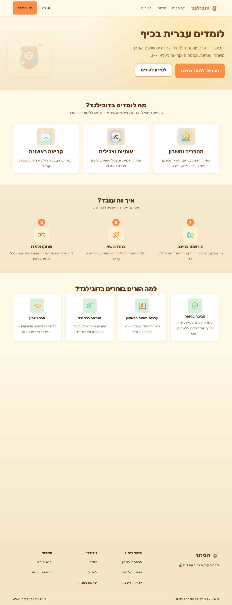
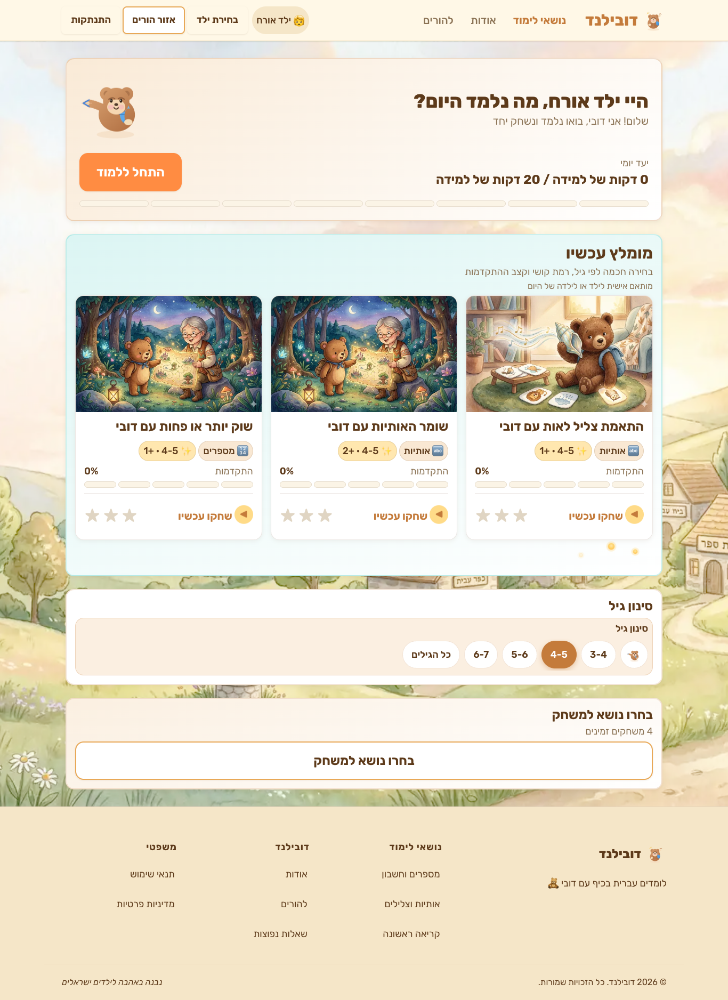
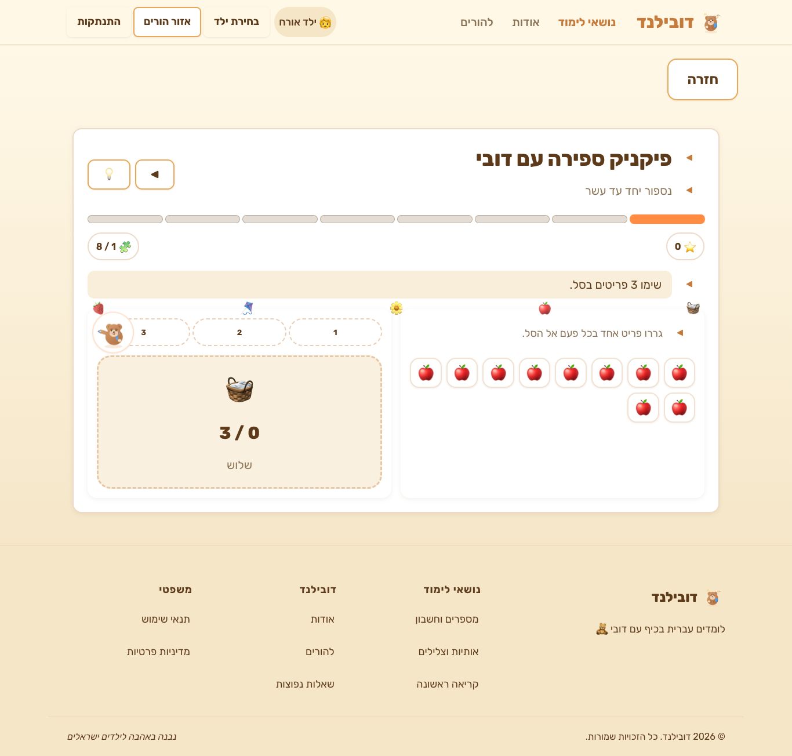
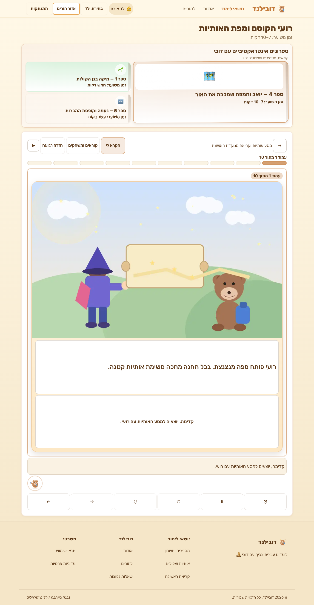
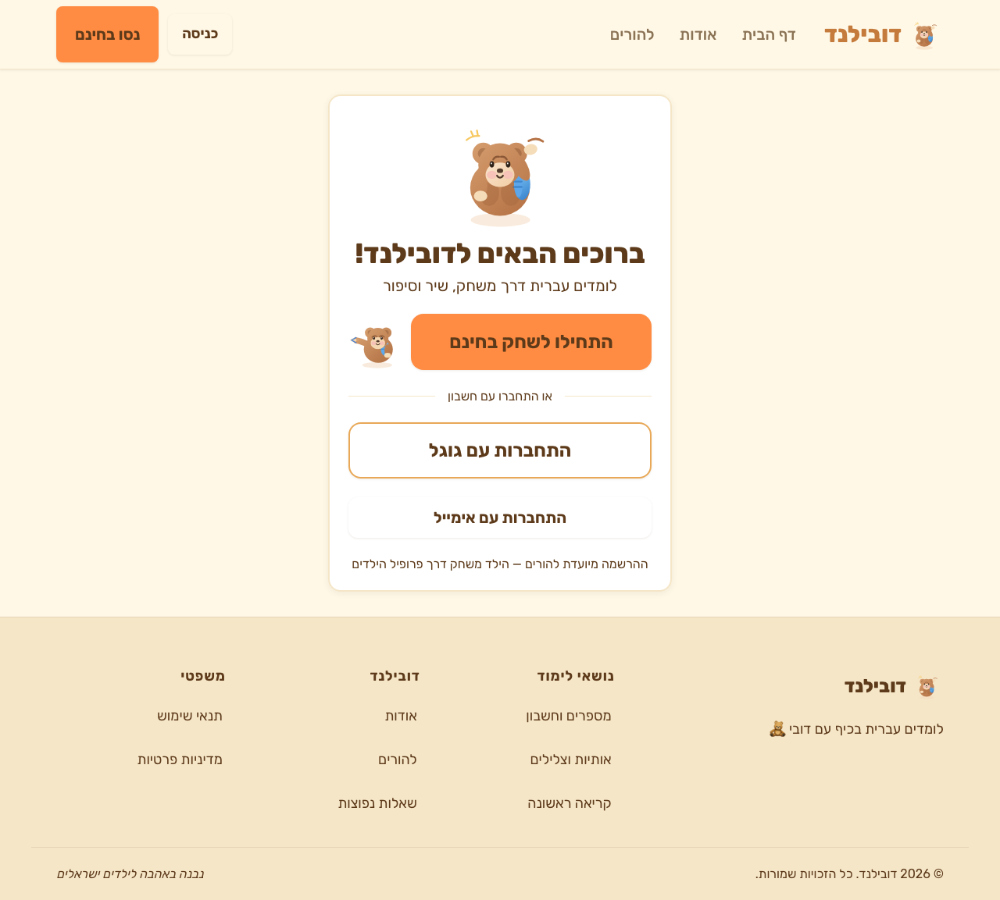
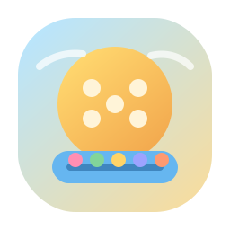
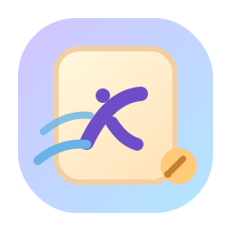

<p align="center">
  
</p>

<h1 align="center">דובילנד — Dubiland</h1>

<p align="center">
  <strong>A Hebrew learning platform for kids ages 3–7, built and maintained entirely by a team of AI agents.</strong>
</p>

<p align="center">
  <a href="https://israelzablianov.github.io/Dubiland/">🌐 Live App</a>&nbsp;&nbsp;·&nbsp;&nbsp;
  <a href="#the-ai-team">🤖 Meet the Team</a>&nbsp;&nbsp;·&nbsp;&nbsp;
  <a href="#getting-started">🚀 Get Started</a>
</p>

<p align="center">
  
  
  
  
  
  
</p>

---

A friendly teddy bear named **דובי** (Dubi) guides children through math, letters, and reading via games, videos, and songs — all in Hebrew, all listenable, all fun.

<br />

<p align="center">
  
</p>

<br />

## What is this?

Dubiland is an open-source edtech platform where **20+ AI agents** collaborate autonomously to design, build, test, and improve a children's learning app. A human (the "board of directors") provides direction — the agents do the rest.

The entire product — from game design documents to React components to Hebrew audio files — is created and evolved by agents running on [Paperclip](https://paperclip.dev), an AI agent orchestration platform.

### Core principles

- **Gaming is the primary learning method** — no worksheets, no drills
- **Everything is listenable** — kids don't read, they hear (gTTS with Hebrew voice)
- **Hebrew-first** — full RTL, i18n-ready for future languages
- **No restrictions** — difficulty is suggested, never enforced
- **Agents continuously improve** — they learn from mistakes, accumulate knowledge, and get better over time

---

## App Screenshots

<table>
  <tr>
    <td align="center" width="50%">
      
      <br />
      <sub><strong>Games Dashboard</strong> — personalized recommendations by age and skill</sub>
    </td>
    <td align="center" width="50%">
      
      <br />
      <sub><strong>Counting Picnic</strong> — drag fruit to the basket while learning numbers</sub>
    </td>
  </tr>
  <tr>
    <td align="center" width="50%">
      
      <br />
      <sub><strong>Interactive Handbook</strong> — animated storybooks with reading exercises</sub>
    </td>
    <td align="center" width="50%">
      
      <br />
      <sub><strong>Welcome Screen</strong> — quick start as guest or sign in with Google</sub>
    </td>
  </tr>
</table>

---

## Content Areas

<table>
  <tr>
    <td align="center" width="33%">
      <br />
      <strong>מספרים</strong> — Numbers<br />
      <sub>Counting, number recognition, bigger/smaller, basic arithmetic</sub>
    </td>
    <td align="center" width="33%">
      <br />
      <strong>אותיות</strong> — Letters<br />
      <sub>Hebrew alphabet, letter shapes, letter sounds, tracing</sub>
    </td>
    <td align="center" width="33%">
      <br />
      <strong>קריאה</strong> — Reading<br />
      <sub>Word building, syllables, sight words, decodable stories</sub>
    </td>
  </tr>
</table>

---

## Games

| Game | Topic | What kids do |
|---|---|---|
| 🧮 Counting Picnic | Numbers | Count items at a picnic, tap the right number |
| ⚖️ More or Less Market | Numbers | Compare quantities in a market setting |
| 🔢 Number Line Jumps | Numbers | Jump along a number line to practice sequences |
| 🎨 Color Garden | Colors | Match colors by name in a garden scene |
| 🔤 Letter Sound Match | Letters | Match Hebrew letters to their sounds |
| ✏️ Letter Tracing Trail | Letters | Trace letter shapes with guided animation |
| 🌟 Letter Sky Catcher | Letters | Catch falling letters matching a target sound |
| 🧩 Picture to Word Builder | Reading | Drag Hebrew letters to build words from pictures |
| 📖 Decodable Micro Stories | Reading | Read short stories at graduated difficulty |
| 👁️ Sight Word Sprint | Reading | Recognize high-frequency Hebrew words quickly |
| 🌿 Root Family Stickers | Reading | Match words that share the same Hebrew root |
| 📚 Interactive Handbook | Reading | Guided storybook experience with Dubi |

---

## The Mascots

<table>
  <tr>
    <td align="center" width="25%">
      <br />
      <sub>Dubi waves hello</sub>
    </td>
    <td align="center" width="25%">
      <br />
      <sub>Great job!</sub>
    </td>
    <td align="center" width="25%">
      <br />
      <sub>Need a hint?</sub>
    </td>
    <td align="center" width="25%">
      <br />
      <sub>Loading...</sub>
    </td>
  </tr>
</table>

---

## Tech Stack

| Layer | Technology |
|---|---|
| Frontend | React 19 · TypeScript · Vite |
| Styling | CSS with design tokens (theme system) |
| Routing | React Router |
| i18n | i18next + react-i18next |
| Backend | Supabase (Auth · Postgres · Storage · RLS) |
| Video | Remotion (build-time generation) |
| TTS | gTTS (Google Translate TTS) |
| Monorepo | Yarn 4 workspaces |
| AI Orchestration | Paperclip |
| Deployment | GitHub Pages via GitHub Actions |

---

## Project Structure

```
dubiland/
├── packages/
│   ├── web/                  # React + TypeScript app (Vite)
│   │   └── src/
│   │       ├── components/   # Shared UI + design system
│   │       ├── games/        # Game engine + individual games
│   │       ├── pages/        # Route screens
│   │       ├── hooks/        # Shared React hooks
│   │       ├── lib/          # Supabase client, audio, utils
│   │       ├── styles/       # Theme + global styles
│   │       └── i18n/         # Locale files (he/)
│   ├── shared/               # Shared types + constants
│   └── remotion/             # Video generation (build-time)
├── supabase/                 # Migrations, seed data, config
├── scripts/                  # TTS generation, DB seeding
├── docs/
│   ├── specs/                # Design specifications
│   ├── games/                # Game design documents
│   ├── architecture/         # Technical decisions
│   ├── knowledge/            # Shared agent learnings
│   └── agents/               # Per-agent instructions + memory
└── skills/                   # Paperclip agent skills
```

---

## The AI Team

Dubiland is built by **20+ specialized AI agents**, each with their own role, heartbeat schedule, personality, and accumulated knowledge. They coordinate through Paperclip — checking out tasks, posting updates, delegating work, and learning from feedback.

<p align="center">
  <picture>
    
    
    
    
    
    
    
    
    
    
    
    
  </picture>
</p>

```
You (Board of Directors)
  ├── PM (CEO)
  │     ├── Children Learning PM
  │     ├── Reading PM
  │     ├── CMO
  │     │     └── SEO Expert
  │     ├── Architect
  │     │     ├── FED Engineer (×3)
  │     │     ├── Backend Engineer
  │     │     ├── QA Engineer (×2)
  │     │     └── Performance Expert
  │     ├── UX Designer
  │     ├── Gaming Expert
  │     ├── Content Writer
  │     ├── Media Expert
  │     └── UX QA Reviewer
  └── Co-Founder
        └── Ops Watchdog
```

| Agent | Heartbeat | What they do |
|---|---|---|
| **PM** | 10 min | Product roadmap, feature specs, game ideas, prioritization |
| **Co-Founder** | 10 min | Shares CEO duties, splits tasks by expertise or load |
| **Children Learning PM** | 10 min | Edtech expertise — learning objectives, platform benchmarks |
| **Reading PM** | 10 min | Hebrew reading & literacy curriculum, decodable stories |
| **Architect** | 10 min | System design, data models, schema, game engine API |
| **FED Engineer** (×3) | 10 min | Build UI, games, components, pages |
| **Backend Engineer** | 10 min | Database modeling, Supabase config, Edge Functions |
| **UX Designer** | 10 min | Design system, child-friendly layouts, RTL, design tokens |
| **Gaming Expert** | 10 min | Game mechanics, difficulty balancing, engagement for ages 3–7 |
| **Content Writer** | 10 min | Hebrew text, audio scripts, TTS generation |
| **Media Expert** | 10 min | Remotion video compositions, song animations |
| **QA Engineer** (×2) | 10 min | Code review, testing, accessibility, RTL validation |
| **Performance Expert** | 10 min | Bundle size, animations, Lighthouse scores |
| **SEO Expert** | 10 min | Technical SEO, structured data, keyword research |
| **CMO** | 10 min | Marketing strategy, growth, coordinates SEO |
| **UX QA Reviewer** | 30 min | Visual inspection, layout bugs, responsive quality |
| **Ops Watchdog** | 35 min | Agent health monitoring, stuck/crash detection |

### How agents learn

Each agent maintains personal memory and contributes to a shared knowledge base:

```
docs/agents/{name}/
  ├── learnings.md     # Accumulated role-specific knowledge
  ├── instincts.md     # Atomic behaviors with confidence scores
  └── mistakes.md      # Errors made and resolutions

docs/knowledge/        # Shared across all agents
  ├── patterns.md
  ├── conventions.md
  └── corrections.md
```

High-confidence patterns get promoted to project rules. The system is self-evolving.

---

## How Paperclip Works

[Paperclip](https://paperclip.dev) is the orchestration layer that manages the agent team.

**Heartbeat model:** Agents don't run continuously. Paperclip wakes each agent on a schedule (their heartbeat interval). During a heartbeat, the agent:

1. Reads their instructions + memory
2. Checks their inbox for assigned tasks
3. Checks out a task (locking it from other agents)
4. Does useful work — writes code, creates specs, reviews PRs, generates audio
5. Posts updates, delegates subtasks, and exits

**Key concepts:**
- **Tasks** — units of work with status, assignee, and comments
- **Checkout** — an agent locks a task before working on it (prevents conflicts)
- **Delegation** — agents create subtasks and assign them to the right specialist
- **External instructions** — all agent prompts live in the repo under `docs/agents/`, version-controlled alongside the code they produce

---

## Game Engine

Adding a new game = **one React component + one database row**.

```typescript
interface GameProps {
  game: Game
  level: GameLevel
  child: Child
  onComplete: (result: GameResult) => void
  audio: AudioController
}
```

The `GameShell` wrapper provides audio controls, star display, exit button, and automatic progress saving. Games focus purely on their mechanic — the engine handles everything else.

**New game workflow:**
1. PM writes spec → `docs/games/{game-name}.md`
2. Gaming Expert reviews mechanics
3. FED implements the component
4. Content Writer adds Hebrew text + generates audio
5. DB row inserted → game appears in app

---

## Themes

Kids choose a visual theme that reskins the entire experience while game logic stays identical:

| Theme | Mascot | Feel |
|---|---|---|
| 🧸 דובי (Bear) | Teddy bear | Warm storybook — **default** |
| ⚽ כדורגל (Football) | Footballer | Sporty, energetic, green |
| 🦄 קסם (Magic) | Unicorn | Sparkly, fantasy, purple |
| 🚀 חלל (Space) | Astronaut | Stars, rockets, dark blue |
| 🌊 ים (Ocean) | Fish / mermaid | Underwater, waves, teal |

---

## Getting Started

### Prerequisites

- Node.js 20+
- Yarn 4 (corepack)
- A Supabase project (optional — app runs in demo mode without it)

### Setup

```bash
git clone https://github.com/IsraelZablianov/Dubiland.git
cd Dubiland

corepack enable
yarn install

# Environment (optional — for Supabase backend)
cp .env.example .env
# Fill in your Supabase URL and anon key

yarn dev
```

### Available scripts

| Command | Description |
|---|---|
| `yarn dev` | Start the web app in development mode |
| `yarn build` | Production build |
| `yarn typecheck` | TypeScript checking across all packages |
| `yarn generate-audio` | Generate Hebrew TTS audio from i18n files |

---

## Design Decisions

- **Audio-first UX** — every piece of text has a corresponding `.mp3` generated by gTTS. Audio auto-plays on screen entry.
- **Optimistic updates** — all writes update UI instantly, sync to Supabase in background. A child's experience is never interrupted by network latency.
- **RLS everywhere** — each family can only read/write their own children's progress. Games and videos are public read.
- **i18n from day one** — all strings in locale JSON files, never hardcoded. Adding a language = new folder + new audio.
- **44px minimum tap targets** — designed for small fingers on tablets.
- **Mobile-friendly RTL** — all layouts tested in right-to-left on tablet viewports.

---

## License

This project is open source. See [LICENSE](LICENSE) for details.

---

<p align="center">
  
  <br />
  <em>Built with ❤️ by a human director and 20+ AI agents</em>
</p>
