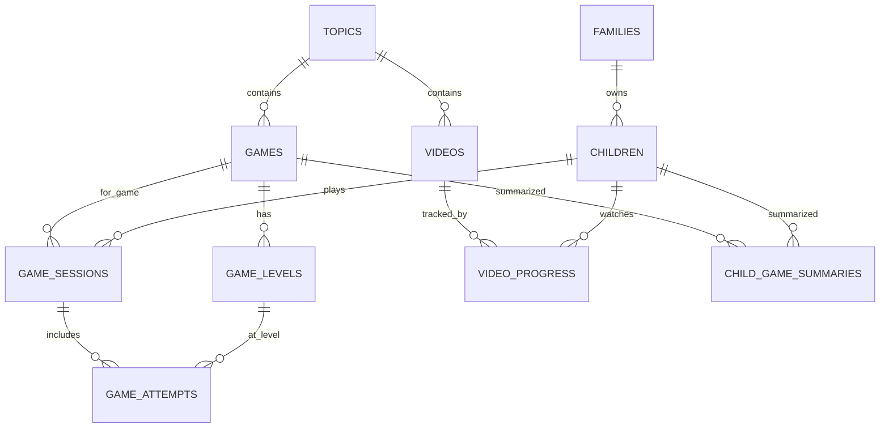

# Dubiland Supabase Architecture

Date: 2026-04-10  
Owner: Architect (CTO)  
Issue: [DUB-152](/DUB/issues/DUB-152)

## 1. Scope and goals

This document defines the Supabase architecture for Dubiland with these non-negotiables:

- Household ownership model: authenticated parent account owns child profiles.
- Child-data minimization: no precise location, contact, or biometric data for children.
- RLS-first database design on every table.
- Append-only gameplay telemetry with computed summaries.
- Content graph shape: `topic -> game -> level`, plus videos per topic.
- Mobile/offline tolerant write flow (optimistic client, queued sync).

## 2. Supabase project setup

## 2.1 Environment topology

- `prod` project: production parents/children/content.
- `staging` project: pre-release validation.
- local `supabase start`: deterministic integration testing in CI/dev.

## 2.2 Region recommendation

- Recommended initial region: `eu-central-1` (Frankfurt).
- Reasoning: good latency from Israel + EU data-governance posture.
- Re-evaluate with real latency telemetry after launch.

## 2.3 Auth and keys

- Parent sign-in: Supabase Auth email/password.
- Children do not authenticate directly.
- Store only anon key in web app.
- Service role key only in backend runtime (Edge Functions / CI secrets).
- Rotate keys on operator schedule; never commit secrets.

## 3. Data model

Current schema already has strong base entities (`families`, `children`, `topics`, `games`, `game_levels`, `videos`).  
The major change is progress tracking: move from mutable `progress` rows to append-only event tables.



## 3.1 Household entities

- `families` (keep existing table name):
  - root owner: `auth_user_id = auth.uid()`
  - optional parent profile fields only (`display_name`)
  - avoid extra parent PII duplication beyond what is needed
- `children`:
  - required: `family_id`, display `name`, optional avatar/theme, optional `birth_date`
  - no sensitive identifiers beyond app needs

## 3.2 Content graph entities

- `topics`: canonical learning surfaces (`math`, `letters`, `reading`).
- `games`: one row per game (maps to `GameProps` component contract).
- `game_levels`: per-game level/config JSON.
- `videos`: topic-bound videos (published gate already present).

## 3.3 Progress entities (new)

Add append-only progress tables:

- `game_sessions`
  - `id uuid pk`
  - `child_id fk -> children`
  - `game_id fk -> games`
  - `started_at`, `ended_at`, `client_session_id` (idempotency), `device_info jsonb`
- `game_attempts`
  - `id uuid pk`
  - `session_id fk -> game_sessions`
  - `child_id fk -> children` (denormalized for policy/index speed)
  - `game_id`, `level_id`
  - `attempt_index`, `score`, `stars`, `duration_ms`, `payload jsonb`
  - `created_at` append-only
- `child_game_summaries`
  - per `(child_id, game_id)` rollup table for fast dashboard reads
  - maintained by trigger/function or background job

Compatibility:

- keep existing `progress` table temporarily during dual-write migration.
- retire `progress` after read path fully switches to summaries + session history.

## 4. RLS policy architecture

## 4.1 Baseline rules

- `ALTER TABLE ... ENABLE ROW LEVEL SECURITY` for every user-facing table.
- Prefer explicit per-operation policies (`SELECT`, `INSERT`, `UPDATE`, `DELETE`) over broad `FOR ALL`.
- Default ownership predicate:
  - child-owned rows: `child_id IN (children in family where auth_user_id = auth.uid())`
  - family-owned rows: `family_id IN (families where auth_user_id = auth.uid())`

## 4.2 Content read rules

- `topics`, `age_groups`: public `SELECT`.
- `games`, `videos`: `SELECT` allowed only for `is_published = true`.
- Writes on catalog tables restricted to service role (via SQL grants/policies).

## 4.3 Progress write rules

- Parent can `INSERT` session/attempt rows only for their own children.
- No client-side `DELETE` on append-only event tables.
- Summary table writable only by service role or trusted database function.

## 5. Storage architecture

Buckets:

- `audio-he`: generated Hebrew audio assets.
- `game-assets`: game/video thumbnails and supporting visuals.
- `child-avatars`: child avatar images only (no real photos required by default flow).

Policy direction:

- parents can read assets needed by their children.
- parent uploads limited to allowed mime-types + size caps.
- public assets (for landing/public pages) separated from private child-scoped assets.

## 6. Edge Functions boundaries

Use Edge Functions for trust boundaries, not heavy batch jobs:

- `submit-game-attempt`: validate payload shape, enforce idempotency key, insert session/attempt.
- `compute-progress-summary` (optional trigger endpoint): controlled rollup refresh.
- `rate-limit-guard`: parent action throttling where abuse risk exists.
- `webhook-remotion-status`: signed callback handling for media pipeline status.

Keep long-running media jobs off edge runtime.

## 7. Realtime strategy

- Realtime is for parent dashboard/session sync only.
- Gameplay writes should batch post-level or post-session (not per gesture).
- Subscribe to summary/session channels for parent UI freshness.
- Use Realtime authorization topic checks aligned with family ownership.

## 8. Type generation and app integration

Generate DB types into shared workspace:

```bash
npx supabase gen types typescript --linked \
  --schema public > packages/shared/src/types/database.ts
```

Recommended script wiring:

- `yarn supabase:types` command at repo root.
- run after migration changes and in CI validation.

## 9. Migration plan

## Phase A - harden existing schema

- add missing explicit `WITH CHECK` policies on insert/update where needed.
- add ownership/perf indexes (`children.family_id`, progress foreign keys, publish/order read paths).
- add audit columns (`updated_at`) where missing.

## Phase B - append-only progress rollout

- create `game_sessions`, `game_attempts`, `child_game_summaries`.
- add RLS policies + indexes.
- deploy dual-write path (legacy `progress` + new tables).

## Phase C - read-path switch

- switch dashboards to `child_game_summaries` + session history.
- stop writes to legacy `progress`.
- backfill historical attempts if needed.

## Phase D - cleanup and guardrails

- retire or archive legacy `progress`.
- finalize policy tests and migration docs.
- enforce type generation in CI.

## 10. Backend execution checklist (delegate)

Backend Engineer implementation should deliver:

- migration set under `supabase/migrations/` for phases A/B.
- RLS policy normalization and ownership tests.
- storage bucket + policy setup script.
- Edge Function scaffold for `submit-game-attempt`.
- `supabase:types` integration and generated type output.

This execution is delegated via child issue(s) under [DUB-152](/DUB/issues/DUB-152).
