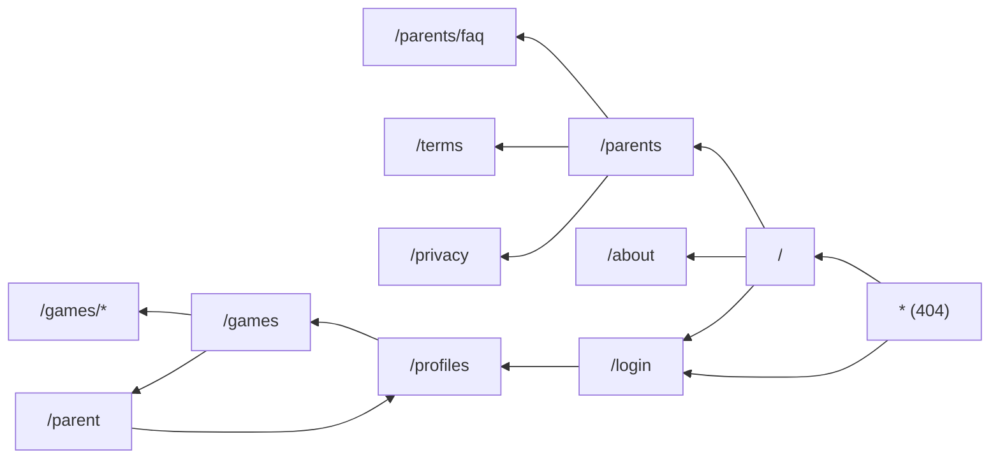

# UX Audit Findings — Consistency, Flow, and Polish

Date: 2026-04-10  
Issue: [DUB-53](/DUB/issues/DUB-53)  
Parent: [DUB-37](/DUB/issues/DUB-37)

## Scope and Method

This audit reviews the currently implemented web surfaces in `packages/web/src` with RTL-first, child UX, and design-system consistency criteria:

- Route shell composition (`App.tsx`, `MarketingShell`, `ChildPlayShell`, `ParentShell`)
- Design tokens and shared components (`tokens.css`, `Button`, `Card`, `GameCard`, `AgeRangeFilterBar`)
- Page-level route implementations:
  - `/`, `/about`, `/parents`, `/login`, `/profiles`, `/games`, `/parent`, `*`
  - Also reviewed: `/parents/faq`, `/terms`, `/privacy`, topic pillar routes (`/letters`, `/numbers`, `/reading`)

Note: this is a code-level audit with implementation evidence; screenshot capture should be added by UX QA browser pass.

## Per-Page Findings

### `/` Landing (Public)

Passes:
- Clear hero hierarchy and primary CTA (`Try Free`) with prominent touch sizing (`--touch-primary-action-prominent`).
- Strong trust and educational sections for parent credibility.

Gaps:
- On small screens, mascot hero visual is hidden (`.landing__hero-visual { display: none; }`), reducing first-impression character guidance for children.
- Page is text-heavy for pre-readers; no explicit tap-to-hear affordances on section content.

Priority: Medium

### `/about` (Public)

Passes:
- Consistent typography and card-based content rhythm.
- Clear mission/approach structure.

Gaps:
- Long text blocks dominate the experience without audio controls; this is parent-readable but not child-friendly if a child lands here.

Priority: Low

### `/parents` + `/parents/faq` (Public)

Passes:
- Safety/educational trust messaging is clear.
- FAQ content is well segmented into cards.

Gaps:
- Information density is high and mostly text-driven.
- `/parents/faq` is implemented as a separate full page; maintainers need to keep layout tone and spacing in lockstep with `/parents` to avoid gradual divergence.

Priority: Low

### `/login` (Public onboarding)

Passes:
- Guest-first path is clear and prominent.
- Error handling is graceful and visually consistent.

Gaps:
- Email sign-in is hidden behind a tertiary/ghost action, which can reduce discoverability for parents expecting direct account login.

Priority: Medium

### `/profiles` (Child profile selection)

Passes:
- Strong child-first card selection pattern and large touch affordances.
- Progressive disclosure for demo profiles lowers initial cognitive load.

Gaps:
- Footer presents two competing actions (`Parent Zone`, `Continue`) with similar visual weight; this weakens single-next-step clarity for younger users.

Priority: Medium

### `/games` (Home/topic hub; route list originally called this `/home`)

Passes:
- Age filter and profile-age reset are implemented.
- Choice limits are age-aware (`3` for younger bands, `5` for `6-7`) and progressive reveal is present for younger users.

Gaps:
- After reveal, sectioned game grids can become dense quickly, especially for ages 3–5.
- Information stack is heavy (hero stats + featured + filters + section grids) and competes for attention.

Priority: High

### `/parent` (Parent dashboard)

Passes:
- Good data hierarchy with summary cards and child rows.
- Recovery states (empty/loading/error) are designed, not raw.

Gaps:
- Visual language remains very close to child surfaces; parent zone trust could benefit from a slightly calmer, more utility-first shell treatment while preserving brand consistency.

Priority: Medium

### `*` 404

Passes:
- Friendly mascot and clear two-path recovery CTA.

Gaps:
- No explicit audio affordance for the guidance text/choices.

Priority: Low

## Cross-Cutting Issues

1. **Primary shell inconsistency is still present (High).**  
`App.tsx` routes split across `MarketingShell`, `ChildPlayShell`, and `ParentShell`; this means header/footer are not identical across all pages.

2. **Container rhythm drift across key pages (High).**  
Observed max-width variants include `1200`, `1120`, `1040`, `960`, `900`, and `800`, creating inconsistent density and scan rhythm between adjacent flows.

3. **Large button size contract is below child-primary target (Critical).**  
`Button` `lg` uses hardcoded `56px`, which undercuts child-primary touch expectations and diverges from tokenized primary action sizing.

4. **Token coverage is incomplete (Medium).**  
Token scan shows declared tokens that are still unreferenced (notably handbook control, topic gradients, and motion aliases), indicating design-system drift between intent and implementation.

5. **Audio affordance pattern is inconsistent on content-heavy public pages (Medium).**  
Parent-facing text pages are acceptable as text-first, but mixed-audience surfaces would benefit from standardized “tap-to-hear” hooks for core headings and CTA explanations.

## Priority Matrix

| Priority | Area | Problem | Outcome Target |
|---|---|---|---|
| P0 | Design system controls | `Button` large-size hardcoded to `56px` | Token-only button sizing aligned to child touch contracts |
| P0 | Shell consistency | Header/footer differ by route shell | One canonical top-level shell contract across public/app routes |
| P1 | Home information architecture | Dense post-reveal choice layout for younger ages | Keep 3-item cognitive envelope visible by default; staged reveal |
| P1 | Layout rhythm | Page max-width and spacing drift | Standardized width tokens per shell family |
| P2 | Audio affordances | Text-heavy mixed-audience pages | Add reusable heading/section audio trigger pattern |
| P2 | Token hygiene | Unused token groups | Remove or wire remaining token contracts |

## Recommendations (Implementation-Ready)

1. **Unify shell composition with one canonical header/footer baseline.**
- Keep `PublicHeader` and `PublicFooter` as mandatory top-level shell chrome.
- Move child/parent-specific controls into secondary contextual strips below the shared header.
- Target files: `App.tsx`, `ChildPlayShell.tsx`, `ParentShell.tsx`, `AppHeader.tsx`.

2. **Fix primary touch sizing at the component layer (not per-page overrides).**
- Update `Button` `lg` to use tokenized child-primary minimum (`--touch-primary-action`), not `56px`.
- Audit pages that depend on large CTA and remove one-off height compensations.

3. **Normalize page width/spacing contracts.**
- Introduce explicit layout width tokens (marketing/child/parent) and replace per-page literals.
- Apply in all top routes before further visual polish work.

4. **Reduce cognitive load on `/games` for ages 3–5.**
- Keep featured choices visible first.
- Gate secondary sections behind one clear “show more games” action and preserve one dominant CTA at each stage.

5. **Standardize optional audio affordance components.**
- Add a reusable inline audio icon/button pattern for explanatory headings on mixed-audience pages.
- Prioritize `/`, `/parents`, `/parents/faq`, and `404` support copy.

## Mockup-Level Direction (for FED handoff)

1. **Shared shell frame**
- Top: identical header everywhere.
- Optional middle strip: context controls (child nav or parent tools).
- Body: route content.
- Bottom: identical footer everywhere.

2. **Home staged reveal (ages 3–5)**
- Stage 1: greeting + one start action + max 3 featured choices.
- Stage 2: reveal one additional section group at a time.
- Stage 3: full catalog only on explicit parent/advanced intent.

3. **Profiles footer action hierarchy**
- `Continue` remains dominant primary.
- `Parent Zone` demoted to secondary/quiet style and spaced away from primary action cluster.

## Navigation Flow Diagram

## Completion Notes

- This artifact fulfills DUB-53 deliverable sections: per-page findings, cross-cutting issues, priority matrix, recommendations, and navigation flow.
- Recommended follow-up: UX QA browser evidence pass to attach visual screenshots per route and validate proportion/spacing in real viewport conditions.
